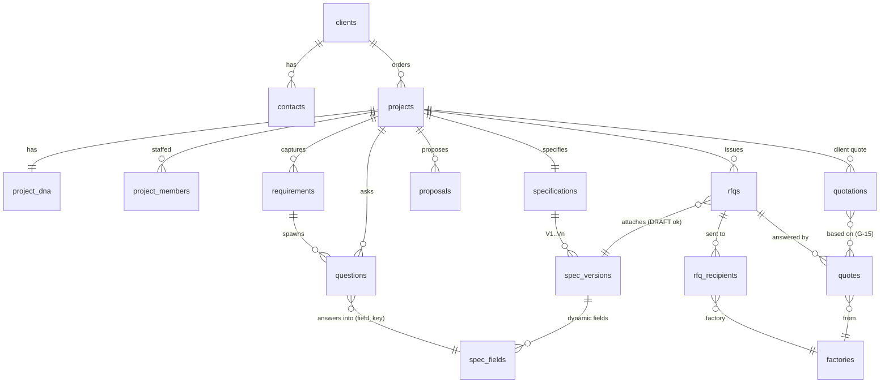
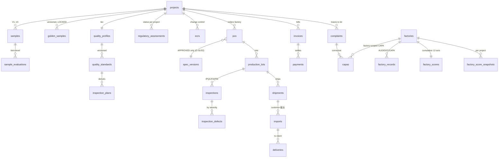
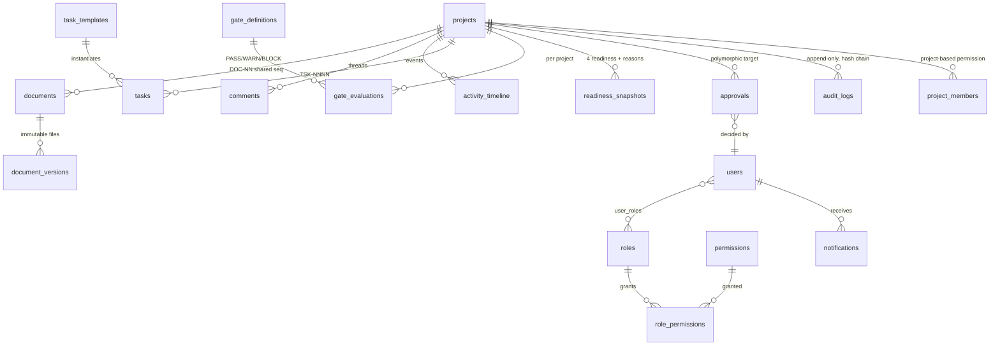
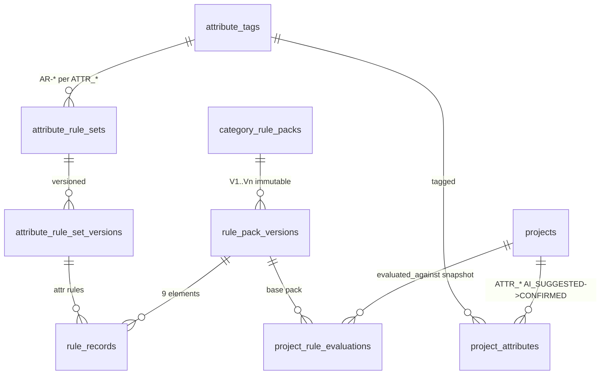

# 15. A3 データ設計（ERD・テーブル定義・State Machine・Audit Architecture）

| 項目 | 値 |
|---|---|
| Status | Draft |
| 版 | v0.1 |
| 日付 | 2026-08-10 |
| 作成エージェント | A3（DB / ERD Architect） |
| 準拠 | 05-governance-pack.md v2.1（ID体系§2・Status enum§3・DNA§4・SoT§6・Version§7・Role§8・Gate§9・ハイブリッド運用§11・2層アーキテクチャ§13・言語ルール§14）/ 01-architecture-overview.md / 14-integration-review.md §3（A3引き継ぎ事項・IR-12） / 18-category-rule-packs.md（Rule Packデータモデル） |
| 参照 | 10-a1（Task/Gate/承認）/ 11-a2（SpecField Statusマッピング §3.1）/ 12-a5（Excel往復 §2.2/§2.4・Factory Score §7.1）/ 13-a6（Regulatory遷移 §1.5・G-03 §4） |

本書は Universal Core（カテゴリー非依存の共通基盤：Layer 1）と Category Rule Pack（カテゴリールールパック：カテゴリー差を表現する設定データの束、Layer 2）の2層アーキテクチャを支える正準データ設計である。DDL（データ定義言語：CREATE TABLE等のSQL文）全文は実装フェーズ（A7承認後）の成果物とし、本書はテーブル定義表・制約方針・State Machine（状態遷移機：状態とイベントの遷移規則の定義）を確定する。

---

## 0. 設計原則（本書全体に適用）

1. **公開ID + サロゲートキー（内部連番キー：外部に見せないDB内部の主キー）の併用**。全テーブルの物理主キーは `id BIGINT`（内部採番・外部非公開）とし、Governance §2 のID体系（`CI-2026-0001` 等）は `public_id` カラムとして別途保持・UNIQUE制約を付す。理由: (a) 公開IDは業務的意味を持ちフォーマット変更リスクがあるため物理FKに使わない、(b) JOIN性能、(c) 公開IDはURL・帳票・WeChat・Excelに露出するため推測困難性は求めない代わり参照整合はサロゲートで担保。
2. **公開IDの採番は `id_sequences` テーブルで一元管理**し、再利用・欠番詰め直しを構造的に不可能にする（§2.14）。Project配下のDOC通番はProposal PDF等も含めて共有（IR-07裁定: DOC-01=Proposal、DOC-02=产品规格书）。
3. **カテゴリー固有カラムの禁止**（Governance §13）。仕様・CTQ（重要品質特性：品質判断の重要基準）・試験項目・検品項目は全て**動的な行**（`spec_fields` / `rule_records` 由来のデータ行）として持ち、「保温性能カラム」「容量カラム」のようなカテゴリー固有の物理カラムをLayer 1スキーマに一切作らない（§8で完全規定）。
4. **enumはGovernance §3 の正準値のみ**。DB上は CHECK制約（値域制約：許可値以外の登録を拒否するDB制約）または参照テーブルで強制する。本書で新たに必要となったStatusは末尾§9「Governance変更提案」として起案し、裁定まで実装対象にしない。
5. **追記専用（append-only：既存行の更新・削除をせず行追加のみで履歴を残す方式）**を `audit_logs` / `approvals`（判定後）/ 承認済み版レコード（Specification版・GoldenSample・RulePack版・Quote等）に適用。削除は Soft Delete（論理削除：`deleted_at` 印付けのみで物理削除しない）を基本とし、**承認履歴（approvals）と監査ログ（audit_logs）はSoft Deleteすら不可**（`deleted_at` カラム自体を持たない）。
6. **テーブル名の正準はsnake_case複数形**とする。正準名は本書§2の定義表が唯一の典拠（例: `audit_logs` が正。12番の `audit_log` 表記は統合レビュー方針どおり本書確定後に一括整合）。10番・12番の `related_tables` に登場する名称は本書の正準名へ読み替える（`regulatory_checks`→`regulatory_assessments`、`packaging_specs`→`spec_fields`の包装領域Field、`bom_items`→`spec_fields`のBOM領域Field＋`documents`）。
7. **HARD Gateの二重防御**（Governance §9）: アプリ層の判定に加え、DB層でもトリガー（DBトリガー：行の変更時に自動実行される検査処理）・CHECK制約・権限剥奪（REVOKE）で物理的に突破不可能にする。承認記録（`approvals`）のFKを持たない遷移をDBが拒否する形で「承認記録なしで突破不可」を実装する。

---

## 1. ERD全体

### 1.1 Layer 1: 商流コア（Client → Project → 要求・仕様・提案・見積）

### 1.2 Layer 1: 品質・生産・物流・アフター

### 1.3 横断層（Document・承認・Task・Gate・監査・権限・通知）

### 1.4 Layer 2: Category Rule Pack層

- Layer 2 → Layer 1 の接続は**一方向**（Rule Engineの出力ビューを `questions` / `spec_fields` 雛形 / `inspection_plans` / `regulatory_assessments` 候補 / `tasks` が消費する）。Layer 1のテーブルはPack IDを知らず、`project_rule_evaluations` のスナップショット経由でのみ参照する。

---

## 2. テーブル定義

### 2.1 共通カラム（全テーブル既定）

| カラム | 型 | 説明 |
|---|---|---|
| id | BIGINT PK | サロゲートキー（内部連番） |
| created_at / created_by | timestamptz / FK users | 作成監査 |
| updated_at / updated_by | timestamptz / FK users | 更新監査（追記専用テーブルには無し） |
| deleted_at / deleted_by / delete_reason | timestamptz ほか | Soft Delete（`approvals` / `audit_logs` はこの3カラム自体を持たない＝削除不可） |

以降の表では共通カラムを省略し、`public_id` の形式・主要カラム・FK（外部キー：他テーブルの行を参照する整合制約）・ユニーク制約のみ記す。型は主要なもののみ明示（JSONB＝構造化データ型：階層データをそのまま格納・検索できる型）。

### 2.2 基盤（顧客・案件・DNA）

| テーブル | public_id | 主要カラム | FK | ユニーク/制約 |
|---|---|---|---|---|
| clients | `CL-{NNNN}` | name, name_kana, billing_info, credit_status, channel_prefs | — | public_id UNIQUE |
| contacts | — | client_id, name, email, line_id, role_in_client, is_primary | clients | (client_id,email) |
| projects | `CI-{YYYY}-{NNNN}` | client_id, title, status(Project enum), entry_route(A/B/C/D), category_name_input, psychology_status(顧客心理enum・内部のみ), closed_reason | clients | public_id UNIQUE。status CHECK=Project enum |
| project_dna | — | project_id, 8軸カラム(exp_level, intent, odm_level, product_risk, quality_level, brand_impact, factory_risk, commercial_risk, priority), 各軸`_status`(AI_SUGGESTED/CONFIRMED ※SpecField enumの部分流用), ai_rationale JSONB | projects | project_id UNIQUE(1:1)。各軸CHECK=§4正準コード |
| project_dna_history | — | project_id, axis, before_value, after_value, reason, approval_id, changed_at | projects, approvals | 追記専用（DNA変更履歴: Governance §4） |
| users | — | name, email, locale, is_active | — | email UNIQUE。CLIENT/FACTORYの外部ユーザーも本テーブル（ロールで遮断） |

### 2.3 要求・仕様（Requirement / Question / Proposal / Specification）

| テーブル | public_id | 主要カラム | FK | ユニーク/制約 |
|---|---|---|---|---|
| requirements | — | project_id, raw_input(原文参照document_id), analysis JSONB(Known/Missing/Conflicting/Assumption/Critical Missing分類), confirmed_at, confirm_approval_id | projects, documents, approvals | 確定後は新行で改訂（確定版は凍結） |
| questions | — | project_id, requirement_id, origin(ANALYZER/RULE_PACK), origin_rule_code(例 RP-001-RQ-01), question_class(QuestionClass enum), text_ja, reason_line, answer_format(CHOICE/NUMBER/IMAGE/FREE_TEXT), choices JSONB, target_spec_field_key, display_stage, default_value, asked_at, answered_at, answer JSONB, answered_by | projects, requirements | **(project_id, target_spec_field_key, dedupe_key) UNIQUE**＝同じ質問を二度しない（11番§3.2-4）。回答済みは全Route共有 |
| proposals | 本体はDB管理・PDF出力物がDOC採番 | project_id, option_label(A/B/C), concept, features JSONB, moq_range, price_range, leadtime_range, tradeoffs, selected(bool), export_document_id | projects, documents | ProposalのTYPEコードは新設せず**PDF出力物をDOC通番で採番**（IR-07裁定維持。本体レコードと出力物を分離するためDOC混雑は許容範囲と判断＝14番§3未確定事項の裁定） |
| specifications | — | project_id, current_version_id | projects, spec_versions | project_id UNIQUE（Specification本体は版のコンテナ） |
| spec_versions | Excel出力時 `{ProjectID}-DOC-{NN}` | specification_id, version_no(V1..Vn), status(**§9提案-1のSpecVersion enum: DRAFT/APPROVED/SUPERSEDED**), draft_revision(int: DRAFT期間中の内部改訂番号), approved_at, approval_id, superseded_by_id, superseded_at | specifications, approvals | (specification_id, version_no) UNIQUE。**APPROVED行はトリガーで凍結**（§7 Versionルール）。詳細は§3.3(IR-12) |
| spec_fields | — | 下表 | spec_versions | (spec_version_id, field_key) UNIQUE |

#### spec_fields 詳細（Field単位Status・根拠・版）

| カラム | 型 | 説明 |
|---|---|---|
| spec_version_id | FK | 所属する仕様版。**版が変わればFieldは新行**（承認版のFieldは版凍結と共にイミュータブル） |
| field_key | text | 正準Fieldキー（例: `capacity`, `lid_type`）。**キー辞書はRule PackのRequired Question `target_spec_field` が供給**し、Layer 1は意味を知らない（カテゴリー固有カラム禁止の中核。§8） |
| name_ja / name_zh | text | 表示名（19番Glossary・Pack payload由来。§14言語ルール準拠） |
| domain | text | 表示・帳票グルーピング（SPEC/BOM/PACKAGING/LABEL 等の汎用区分のみ。カテゴリー語彙は不可） |
| value / unit | JSONB / text | 型付き値（数値・選択・レンジ・画像参照）。選択肢体系はPack由来（IR-04のlid_type選択肢もPackデータ更新のみで対応可＝スキーマ変更不要） |
| status | CHECK | **SpecField enum: CONFIRMED / PROVISIONAL / AI_SUGGESTED / UNKNOWN** |
| source_role | CHECK | 根拠区分＝Role正準キーを流用: CLIENT(顧客入力)/AI(AI推定)/FACTORY(工場回答)/SALES/PM/CN_OFFICE/SYSTEM |
| source_ref_table / source_ref_id | polymorphic | 根拠レコード（question回答・quote行・document取込・sample評価） |
| confirmed_by / confirmed_at / confirm_approval_id | FK | CONFIRMED昇格の記録（11番§3.1: Known→PROVISIONAL / Assumption→AI_SUGGESTED / Missing→UNKNOWN、確定操作でCONFIRMED） |
| client_visible / factory_visible | bool | 情報遮断の行単位制御（既定はfield_key辞書の既定値、案件で上書き可・緩和方向はMGR承認必須） |

### 2.4 工場・見積（Factory / RFQ / Quote / Quotation）

| テーブル | public_id | 主要カラム | FK | ユニーク/制約 |
|---|---|---|---|---|
| factories | `FA-{NNNN}` | name, name_zh, region, capabilities JSONB(工程・設備タグ), certifications JSONB, wechat_contact, portal_enabled | — | public_id UNIQUE |
| factory_records | `FA-{NNNN}-{AUD\|DOC\|CAPA}-{NN}` | factory_id, type(AUD/DOC/CAPA), summary, document_id, valid_until | factories, documents | public_id UNIQUE（案件非依存の付帯記録: v1.1 A5②） |
| factory_scores | — | factory_id, 12軸カラム(score_quality〜score_capacity 各numeric), axis_mode JSONB(手動/自動: 12番M4の手動5軸開始), total_weighted, updated_at | factories | factory_id UNIQUE（**累積**スコア） |
| factory_score_snapshots | — | factory_id, project_id, taken_at, axes JSONB, trigger_event | factories, projects | **案件別スナップショットと累積を分離保存**（12番§7.1） |
| factory_score_events | — | factory_id, project_id, axis, delta, event_type(G-06発動/CRITICAL不良/納期遵守 等), recovery_eligible_after | factories | 追記専用。**減点即時・回復緩慢の非対称性**をイベント履歴で担保（自動回復させない） |
| rfqs | `{ProjectID}-RFQ-{NN}` | project_id, spec_version_id(**DRAFT版参照可**＝IR-12), quantity_scenarios JSONB, reply_due, status_derived(発行はapproval+issued_at), issue_approval_id, gate_warns JSONB(G-11/12/13/14のWARN記録) | projects, spec_versions, approvals | public_id UNIQUE |
| rfq_recipients | — | rfq_id, factory_id, sent_at, sent_channel(EXCEL/WECHAT/PORTAL), read_at, responded_at, reminder_count | rfqs, factories | (rfq_id, factory_id) UNIQUE |
| quotes | `{ProjectID}-QT-{NN}` | rfq_id, factory_id, currency, price_tiers JSONB, tooling_cost, sample_fee, moq, lead_time_days, payment_terms, valid_until, required_docs_status JSONB(A6§3.6書類の有無＝比較評価軸: IR-05), source_document_id(返信Excel原本) | rfqs, factories, documents | public_id UNIQUE。**CLIENT/FACTORY遮断ビューに一切露出しない**（§7） |
| quotations | `{ProjectID}-QO-{NN}` | project_id, version_no, based_on_quote_ids JSONB(空=G-15概算), is_provisional bool(**G-15: trueなら「概算」透かし強制**), lines JSONB, margin(内部のみ), approval_id, sent_at | projects, approvals | public_id UNIQUE。**FACTORY遮断ビューに露出しない**（顧客販売価格） |

### 2.5 サンプル・品質（Sample / GoldenSample / Quality）

| テーブル | public_id | 主要カラム | FK | ユニーク/制約 |
|---|---|---|---|---|
| samples | `{ProjectID}-SMP-{NN}`(=V{n}) | project_id, factory_id, version_no, purpose(評価/試験用: 13番§3.2の試験用織込み), status(**§9提案-3**), requested_at, shipped_at, received_at, tracking_no | projects, factories | public_id UNIQUE |
| sample_evaluations | — | sample_id, item_key(CTQ/外観/寸法等の動的キー: Rule Pack CtqList由来), result(**Sample評価enum: APPROVED/REJECTED/CONDITIONAL/PENDING**), measured JSONB, photos JSONB, evaluated_by | samples | (sample_id, item_key) UNIQUE。項目単位判定（Governance §3） |
| golden_samples | `{ProjectID}-GS-{NN}` | 下表 | projects, samples, approvals, documents | (project_id, version_no) UNIQUE |
| quality_profiles | — | project_id, tier(Q1〜Q4), client_choice_label(コスト重視/標準/ブランド重視/プレミアム), tier_approval_id, fixed_minimum_ack bool | projects, approvals | project_id UNIQUE。Tier確定はC_HUMAN_DECISION |
| quality_standards | — | project_id, version_no, status(SpecVersion enum流用※§9提案-1参照), items JSONB(**外観A/B/C面×欠陥種×限度・AQL値等は全て動的行データ**。数値の正は16番A4), approval_id, superseded_by_id | projects, approvals | (project_id, version_no) UNIQUE。承認版凍結（§7） |
| inspection_plans | — | project_id, quality_standard_id, stage(IPQC/FIRST_ARTICLE/PRE_SHIPMENT), sampling JSONB(AQL/水準/Ac-Re), check_items JSONB(中国語併記・Rule Pack InspectionPlanView由来), frisk_derived_density(FRISK連動: 12番§7.2), approval_id | projects, quality_standards | (project_id, stage, version) UNIQUE |

#### golden_samples 詳細（LOCKED後のイミュータブル性）

| カラム | 説明 |
|---|---|
| project_id / sample_id / version_no | 元サンプル（V{n}）への参照と黄金样の版 |
| status | **GoldenSample enum: DRAFT / CLIENT_APPROVED / COMPANY_APPROVED / FACTORY_ACKNOWLEDGED / LOCKED / SUPERSEDED** |
| client_approval_id / company_approval_id | 3者承認のうち商流側2者のApproval FK。**FKがNULLのままの前進遷移をCHECKで拒否** |
| factory_ack_document_id | 工場签回の証跡（13シートSheet13の署名・盖章スキャン＝12番§6） |
| locked_at / lock_task_id | LOCK登録（JP-SMP-060）記録 |
| superseded_by_id / supersede_ecr_id | 新版への差替え。**ECR承認FKが無いSUPERSEDED遷移をトリガーで拒否** |
| photos JSONB / storage_location | 現物写真・双方保管場所（限度样3点セットの参照は quality_standards 側） |

**イミュータブル性のDB保証（3層）**:
1. `BEFORE UPDATE` トリガー: `status='LOCKED'` の行への更新は、「`LOCKED→SUPERSEDED` への遷移で、かつ `superseded_by_id`・`supersede_ecr_id`（承認済みECR）・実行者記録のみを設定する更新」以外を**例外送出で全拒否**。値・写真・承認FKの書き換えは物理的に不可能。
2. `BEFORE DELETE` トリガー + アプリDBロールからの `DELETE` 権限REVOKE: 物理削除不可。Soft Deleteも `LOCKED/SUPERSEDED` 行には不可（トリガーで拒否）。
3. **変更は新Version行の生成のみ**: 新行 `version_no+1` を `DRAFT` で作成し3者承認をやり直す（`{ProjectID}-GS-{NN}` は新番号採番）。旧行は手順1の遷移で `SUPERSEDED` になる。G-02はプロジェクトの「最新版がLOCKEDであること」を参照する。

### 2.6 法規・変更管理（Regulatory / ECR）

| テーブル | public_id | 主要カラム | FK | ユニーク/制約 |
|---|---|---|---|---|
| regulatory_assessments | 出力物は`{ProjectID}-DOC-{NN}` | project_id, status(**Regulatory enum**), candidates JSONB(law/applicability/basis/expert_check: 13番§1.3), required_documents/tests/labels/import_procedures JSONB, rfq_requirements JSONB, checked_against(チェックリスト版), evaluated_against(Rule Pack版: 18番§8.3), ai_notes, status_changed_by, status_approval_id | projects, approvals | 最新1行+履歴行（status変更は新行追加＝追記型）。**BLOCKED設定・解除はapproval_id必須をCHECKで強制**（G-03） |
| ecrs | `{ProjectID}-ECR-{NN}` | project_id, factory_id, status(**ECR enum**), change_category(材质/供应商/结构/工艺/颜色/包装/产地/其他), before_after JSONB, reason, impact JSONB(性能・外観・納期・コスト・再試験・黄金样再签), switch_lot_id(切替批次), decision_approval_id, implemented_at | projects, factories, production_lots, approvals | public_id UNIQUE。1ページ様式（12番§8.2/M6）の全項目を格納 |

### 2.7 発注・生産・検品・物流・財務

| テーブル | public_id | 主要カラム | FK | ユニーク/制約 |
|---|---|---|---|---|
| pos | `{ProjectID}-PO-{NN}` | project_id, factory_id, spec_version_id, quantity, amount, currency, incoterms, payment_milestones JSONB, status(**§9提案-2**), issue_approval_id, factory_confirm_document_id | projects, factories, spec_versions, approvals | public_id UNIQUE。**発行時トリガー: 参照spec_versionsの status='APPROVED' でなければISSUED遷移拒否**（IR-12のDB防御・G-01/G-02系） |
| production_lots | `{ProjectID}-LOT-{NN}` | po_id, status(**Production enum: MATERIAL_PREP〜READY_TO_SHIP**), quantity, planned/actual milestone dates JSONB(P10..P100), first_article_inspection_id | pos, inspections | public_id UNIQUE。PILOT→P10は首件检验合格FK必須（CHECK） |
| inspections | `{ProjectID}-INS-{NN}` | project_id, lot_id, plan_id, stage(IPQC/FIRST_ARTICLE/PRE_SHIPMENT), result(**Approval enumを流用**: PENDING=未判定/APPROVED=合格/REJECTED=不合格/CONDITIONAL=特採※MGR承認必須), sample_size, defect_summary JSONB, report_document_id, inspector_role, result_approval_id | projects, production_lots, inspection_plans, documents, approvals | public_id UNIQUE。**再検査は新行**（結果の上書き禁止）。REJECTED未処理でG-05 |
| inspection_defects | — | inspection_id, severity(**Defect enum: CRITICAL/MAJOR/MINOR**), item_key, qty, photos JSONB, disposition(返工/選別/特採/廃棄) | inspections | CRITICAL>0 で自動的にG-05 BLOCK証跡 |
| shipments | `{ProjectID}-SHP-{NN}` | project_id, lot_ids JSONB, status(**§9提案-4**), release_approval_id(**Portal上のApprovalのみ有効＝12番§2.1-2**), booking JSONB, etd, eta, container_photos(document参照) | projects, approvals | public_id UNIQUE。**RELEASED遷移はrelease_approval_id必須+G-03/04/05/06全PASSをトリガー検証** |
| imports | — | shipment_id, customs_status_dates JSONB, import_notification JSONB(食品等輸入届出: 届出番号・届出済証document_id), duty_amounts | shipments, documents | 食品接触案件は届出済証FKなしで通関完了登録不可（CHECK、13番§3.4） |
| deliveries | — | import_id, project_id, delivered_at, received_by, delivery_report_document_id | imports, projects | — |
| invoices | — | project_id, direction(顧客請求/工場支払), amount, currency, milestone, issued_at, due_date | projects | 状態は導出（issued/paid=payments突合） |
| payments | — | invoice_id, paid_at, amount, method, matched_by | invoices | 追記専用（消込の取消は逆仕訳行） |

### 2.8 クレーム・CAPA

| テーブル | public_id | 主要カラム | FK | ユニーク/制約 |
|---|---|---|---|---|
| complaints | `{ProjectID}-CMP-{NN}` | project_id, lot_id(トレーサビリティ), severity(Defect enum), root_cause(**Complaint根本原因enum: FACTORY/TRADING_COMPANY/CLIENT/LOGISTICS/END_USER/UNKNOWN**), status(**§9提案-5**), received_at, description, evidence_document_ids JSONB, resolution | projects, production_lots | public_id UNIQUE。UNKNOWN≠商社責任（enum注記どおり） |
| capas | `{ProjectID}-CAPA-{NN}` または `FA-{NNNN}-CAPA-{NN}` | scope(PROJECT/FACTORY), project_id NULL可, factory_id, complaint_id/inspection_id NULL可, status(**§9提案-5**), corrective JSONB, preventive JSONB, due_date, submitted_at, verified_at, verification_approval_id, effectiveness_check_due | projects, factories, complaints, inspections, approvals | public_id UNIQUE。scope=FACTORYはfactory_records系の採番を使用（案件非依存CAPA） |

### 2.9 文書・コミュニケーション（ハイブリッド運用の証跡）

| テーブル | public_id | 主要カラム | FK | ユニーク/制約 |
|---|---|---|---|---|
| documents | `{ProjectID}-DOC-{NN}` / `FA-{NNNN}-DOC-{NN}` | 下表 | projects/factories | public_id UNIQUE。**DOC通番はProject内で全DocType共有**（IR-07） |
| document_versions | — | 下表 | documents | (document_id, version_no) UNIQUE。**行は作成後イミュータブル**（原本上書き禁止: 12番§2.2-8） |
| comments | — | project_id, target_table/target_id, body, author_id, visibility(INTERNAL/CLIENT/FACTORY), lang | projects, users | 遮断: visibilityで制御、既定INTERNAL |
| activity_timeline | — | project_id, occurred_at, event_type, summary_ja, actor, ref_table/ref_id | projects | 追記専用の表示用イベントストリーム（監査の正はaudit_logs） |
| notifications | — | user_id, project_id, task_id, kind, channel(MAIL/PORTAL/LINE/WECHAT_QUEUE), payload JSONB, sent_at, read_at | users, projects, tasks | 状態は導出（sent/read）。エスカレーション連鎖は10番のnotificationルールをデータ化 |

#### documents / document_versions 詳細

| カラム（documents） | 説明 |
|---|---|
| kind | EXPORT(システム出力) / INBOUND_ORIGINAL(工場返信Excel原本) / WECHAT_EVIDENCE(WeChat元メッセージ・スクリーンショット) / CLIENT_INPUT / CERTIFICATE / DRAWING / OTHER |
| doc_type | RFQ / SPEC / QUALITY_STD / INSPECTION_REPORT / PROPOSAL_PDF / ECR_FORM / …（帳票種別。§5のExcel出力メタと連動） |
| channel | WEB / EXCEL / WECHAT / EMAIL（Governance §11のチャネル記録） |
| title / lang | 表示名・言語 |

| カラム（document_versions） | 説明 |
|---|---|
| version_no / file_key / mime / size | 版とファイル実体（ストレージキー） |
| sha256 | ファイルのSHA-256（ハッシュ値：内容改竄検知用の指紋）。12番§2.4 `_meta` と一致検証 |
| export_meta JSONB | **Excel出力メタ**: project_public_id / doc_type / version / exported_at / source_record_table+id / watermark(DRAFT/APPROVED)。§5参照 |
| generated_filename | システム生成ファイル名 `{ProjectID}_{DocType}_V{n}_{YYYYMMDD}_{DRAFT\|APPROVED}.xlsx`。**CHECK制約で「最新」「latest」「final」等の禁止語を含む名前を拒否**（§7 Versionルールのシステム的担保） |
| original_filename | 受領時の元ファイル名（参考メタのみ。出力・表示には使わない） |
| stale_version_response | bool。**旧版回答フラグ**（12番§2.4-3: 旧版Excelへの記入返信。BLOCKせず差分レビューへ） |
| sot_promoted / promoted_at / promotion_approval_id / promoted_to JSONB | **SoT昇格フラグ**: 構造化取込→承認でSoT昇格した事実と、昇格先レコード（quotes/spec_fields等）の参照（Governance §6-3/§11-2） |
| wechat_meta JSONB | WeChat証跡: 送受信者・受信日時・構造化要約（12番§2.3受信フォーマット）・元メッセージversionへの参照 |

### 2.10 Task・Gate・Readiness

| テーブル | public_id | 主要カラム | FK | ユニーク/制約 |
|---|---|---|---|---|
| task_templates | `JP-{領域}-{NNN}` / `CN-{領域}-{NNN}` | Governance §5の15項目をカラム化（name, name_zh, purpose, owner_role, trigger_expr, inputs JSONB, system_action, ai_action, human_action, outputs JSONB, approval_required+approver_role, blocking_condition, deadline_rule, notification_rules JSONB, related_docs/related_tables JSONB, automation_class, gates JSONB） | — | public_id UNIQUE |
| tasks | `{ProjectID}-TSK-{NNNN}` | project_id, template_id, status(**Task enum: TODO/IN_PROGRESS/WAITING_CLIENT/WAITING_CHINA/WAITING_APPROVAL/DONE/SKIPPED/BLOCKED**), assignee_id, due_at, generated_by_rule(R-01〜R-14等), skip_reason, approval_id | projects, task_templates, approvals | public_id UNIQUE。DONE行はTask Generator再実行でSKIP対象外（10番§4） |
| task_dependencies | — | task_id, depends_on_task_id | tasks | (task_id, depends_on_task_id) UNIQUE（DAG＝有向非巡回グラフ：後続関係の表現） |
| gate_definitions | `G-{NN}` | §4参照 | — | public_id UNIQUE |
| gate_evaluations | — | project_id, gate_id, evaluated_at, result(**Gate判定enum: PASS/WARN/BLOCK**), reasons JSONB, checkpoint_action, warn_ack_by/warn_ack_at(SOFT通過の記録), override_approval_id(HARDは常にNULL＝**Override不可をCHECKで表現**: HARD Gateではこのカラムへの非NULL設定を拒否) | projects, gate_definitions, approvals | 追記専用（評価履歴） |
| readiness_snapshots | — | project_id, taken_at, rfq_ready/sample_ready/production_ready/shipment_ready(bool), missing_reasons JSONB(4種別の不足理由リスト), trigger_event | projects | 追記専用。導出の正は `v_readiness` ビュー（§4.3）、本表はチェックポイント時点の証跡固定 |

### 2.11 承認・監査（append-only）

| テーブル | public_id | 主要カラム | FK | ユニーク/制約 |
|---|---|---|---|---|
| approvals | — | project_id NULL可, target_table/target_id(polymorphic), request_type(PROPOSAL承認/RFQ承認/PO発行/GS承認/出荷承認/…), requested_by/requested_at, approver_role, approver_id, deputy_approver_id(**代理承認者必須**: Hard Gate系request_typeはNULL不可CHECK＝Governance §8), status(**Approval enum: PENDING/APPROVED/REJECTED/CONDITIONAL**), decided_by/decided_at, conditions, reason, evidence_document_id | projects, users, documents | **一発判定トリガー**: PENDING→終端状態への1回のみ更新可。判定後の行は全カラム凍結。`deleted_at`カラムなし＝**承認履歴削除不可** |
| audit_logs | — | §6参照 | — | 追記専用・削除不可・ハッシュ連鎖 |

### 2.12 権限（RBAC + Project Based Permission）

| テーブル | 主要カラム | 制約 |
|---|---|---|
| roles | code(**Role正準キー: CLIENT/SALES/PM/QA/REG/TRADE/MGR/CN_OFFICE/FACTORY/SYSTEM/AI**), name_ja | code UNIQUE。行追加はGovernance変更手続のみ（参照データ） |
| permissions | code(例 `project.read`, `quote.read`, `quotation.read`, `spec.write`, `approval.decide`, `export.rfq`), sensitivity(NORMAL/COST/MARGIN/OTHER_FACTORY/CLIENT_INTERNAL) | code UNIQUE。**原価・粗利・他工場情報はsensitivityで機械判別可能に** |
| role_permissions | role_id, permission_id | (role_id, permission_id) UNIQUE |
| user_roles | user_id, role_id | (user_id, role_id) UNIQUE |
| project_members | project_id, user_id, role_id, factory_id NULL可(FACTORYユーザーの所属工場), valid_from/valid_to | (project_id, user_id, role_id) UNIQUE。**案件に紐づかないユーザーは案件データに一切アクセス不可**（Project Based Permission） |

**CLIENT / FACTORY への情報遮断の保証層（3層）** — 詳細は§7:
1. **DBビュー（View：元表の一部カラム・行だけを見せる仮想表）層**: CLIENT用・FACTORY用のDBロールにはベーステーブルへのSELECT権を一切与えず、遮断済みビュー（`v_client_*` / `v_factory_*`）のみGRANTする。`quotes`（工場原価）・`quotations.margin`（粗利）・他工場の行はビュー定義に**構造的に存在しない**。
2. **アプリ層**: permission code + sensitivity による認可チェック（二重防御）。
3. **Export層**: Excel/PDF/WeChatDigest生成は遮断済みビューのみをデータソースにできる（生成テンプレートがベーステーブルを参照するとビルド時検証で拒否。12番§2.3の「テンプレート側で参照不可」を実装）。帳票からの粗利漏洩が最頻事故経路（01番§8）のための必須要件。

### 2.13 Layer 2: Rule Pack層

| テーブル | public_id | 主要カラム | FK | ユニーク/制約 |
|---|---|---|---|---|
| category_rule_packs | `RP-{NNN}` | category_name_ja/zh/en, owner_role(PM等), current_approved_version_id | rule_pack_versions | public_id UNIQUE（Packの同一性。版はversionsで管理） |
| rule_pack_versions | `RP-{NNN}` + `V{n}` | pack_id, version_no, status(**RulePack enum: DRAFT/REVIEW_REQUIRED/APPROVED/SUPERSEDED**), default_attributes JSONB(ATTR_*), qa_approval_id, reg_approval_id, mgr_approval_id, source_projects JSONB, change_note | category_rule_packs, approvals | (pack_id, version_no) UNIQUE。**APPROVED行はトリガー凍結**（18番§7.2: 誤字修正も新版）。APPROVED遷移は3承認FK必須CHECK（18番§7.1手順3-5） |
| rule_records | `RP-{NNN}-{RQ\|CTQ\|RSK\|REG\|TST\|QS\|FQ\|IT\|PK}-{NN}` / `AR-{属性略号}-{NN}` | pack_version_id NULL可 / attr_set_version_id NULL可(**CHECK: 排他的にどちらか一方**), element(9要素enum: REQUIRED_QUESTION/CTQ/RISK/REGULATORY_CANDIDATE/TEST_PLAN/QUALITY_STANDARD/FACTORY_QUALIFICATION/INSPECTION_TEMPLATE/PACKAGING_REQUIREMENT), condition_dsl text(**登録時ホワイトリスト検証**: ATTR_*/Q1-Q4/PRISK_*/ODM_*/BIMP_*/AND/OR/NOT/数値比較のみ。関数・スクリプト・カテゴリー名は拒否＝18番§1.4), priority_class(SAFETY/REGULATORY/FUNCTION/DURABILITY/APPEARANCE/SENSORY/LOGISTICS), tier_scaling JSONB(**CHECK: priority_class∈{SAFETY,REGULATORY}なら4Tier値同一**＝FIXED MINIMUM構造強制), payload JSONB(要素別スキーマ検証: 18番§1.3), topic_key, source, notes_ja/notes_zh | rule_pack_versions, attribute_rule_set_versions | rule_code UNIQUE within owner version。**payloadスキーマ外フィールドは登録拒否** |
| attribute_tags | `ATTR_*` | code, name_ja, name_zh, description | — | code UNIQUE。**行の追加・削除はGovernance変更手続のみ**（§13正準レジストリの参照データ化。アプリからはREAD ONLY） |
| attribute_rule_sets | `AR-{属性略号}` | attribute_code, current_approved_version_id | attribute_tags | attribute_code UNIQUE |
| attribute_rule_set_versions | — | set_id, version_no, status(RulePack enum流用: Packと同じライフサイクル＝18番§7.2), approvals同様 | attribute_rule_sets | (set_id, version_no) UNIQUE。承認版凍結 |
| project_attributes | — | project_id, attribute_code, status(AI_SUGGESTED/CONFIRMED ※SpecField enumの部分流用: Governance §13の運用どおり), ai_confidence, excluded bool(**人間による非該当確定**), excluded_reason, exclusion_approval_id, confirmed_by/confirmed_at | projects, attribute_tags, approvals | (project_id, attribute_code) UNIQUE。**AI_SUGGESTED→CONFIRMEDは確定者記録必須。excluded=trueはapproval_id+理由必須**（18番§2.2 B-4: 除去理由・承認者をAuditLogにも記録） |
| project_rule_evaluations | — | project_id, evaluated_at, base_pack_version_id NULL可(未知カテゴリー時NULL＝仮想Pack), evaluated_against text(例 `RP-001-V2`: 監査再現用の版記録＝18番§7.2), attr_set_versions JSONB, inputs JSONB(属性・Tier・DNAスナップショット), output_views JSONB(QuestionList/CtqList/TestPlanView/InspectionPlanView/RegulatoryCandidateView/FactoryQualView/PackagingView), conflicts JSONB(**両立不能ペア＝REVIEW_REQUIRED相当の人間裁定待ちリスト**: 18番§2.4), resolved_by/resolved_at, is_current bool | projects, rule_pack_versions | 追記専用（再評価は新行）。**「当時どのルールで判断したか」を常に再現可能** |

### 2.14 採番管理

| テーブル | 主要カラム | 制約 |
|---|---|---|
| id_sequences | scope_type(PROJECT/FACTORY/GLOBAL), scope_id, type_code(RFQ/QT/QO/SMP/GS/ECR/PO/LOT/INS/SHP/CMP/CAPA/DOC/TSK/AUD…), last_no | (scope_type, scope_id, type_code) UNIQUE。**単調増加のみ**（採番関数は `last_no+1` の返却しかできない＝再利用・欠番詰め直しの構造的禁止。Governance §2） |

**テーブル数: 62**（ビュー・パーティションを除く）。

---

## 3. State Machine定義

書式: 状態 / イベント / 遷移先 / ガード（遷移許可条件） / 副作用。全遷移は `audit_logs` 記録必須（§6）。ガード列の「Approval」は `approvals` の該当FKがAPPROVEDで存在することを意味し、DB制約（トリガー/CHECK）とアプリ層の二重防御で実装する。

### 3.1 Project

| 状態 | イベント | 遷移先 | ガード | 副作用 |
|---|---|---|---|---|
| DRAFT | 受付処理完了（JP-LEAD-010/020） | ACTIVE | — | Task Generator起動、DNA推定(AI_SUGGESTED) |
| ACTIVE | 保留操作 | ON_HOLD | 理由必須 | 期限監視停止、顧客/工場へ通知はRole判断 |
| ON_HOLD | 再開操作 | ACTIVE | — | 期限再計算 |
| ACTIVE | 納品完了+入金消込完了 | CLOSED_WON | deliveries完了 かつ invoices(顧客請求)全消込 | Factory Score加点、Repeat候補登録（N-15） |
| ACTIVE | 失注確定 | CLOSED_LOST | SALES操作+理由 | 休眠Lead化 |
| DRAFT/ACTIVE/ON_HOLD | 中止 | CANCELLED | PO発行済の場合はMGR Approval必須 | 未完了Task一括SKIP、工場への中止通知Task起票 |

### 3.2 SpecField（Field単位・11番§3.1マッピング準拠）

| 状態 | イベント | 遷移先 | ガード | 副作用 |
|---|---|---|---|---|
| UNKNOWN | 顧客回答（Known） | PROVISIONAL | 回答の構造化取込 | questions.answered_at設定、Readiness再判定 |
| UNKNOWN | AI補完（Assumption） | AI_SUGGESTED | 根拠テキスト必須 | 画面に「当社の想定」表示（勝手に確定しない） |
| AI_SUGGESTED | 顧客回答/「おすすめで進める」明示選択 | PROVISIONAL | — | — |
| AI_SUGGESTED / PROVISIONAL | 確定操作（Requirement確定・個別確定） | CONFIRMED | 確定者記録（source_role, confirmed_by） | 材質・用途・対象年齢・訴求Fieldなら Regulatory→CHECKING 自動差戻し（13番§1.5） |
| CONFIRMED | 変更受付（顧客要望/ECR） | PROVISIONAL | **承認済み版のFieldは直接変更不可**→新版DRAFTのFieldとして変更（§3.3） | Regulatory差戻し、Readiness false化、影響Task再生成 |
| 任意 | 工場回答の取込 | PROVISIONAL | SoT昇格Approval（12番§2.2-7） | source_role=FACTORY、根拠document参照 |

### 3.3 Specification版 — ★IR-12の解決

**裁定（A3設計判断）**: 产品规格书の版番号は**単一系列（V1, V2, …）**とし、「RFQ時ドラフト」と「量産前正式版」は**同一版番号のDRAFT→APPROVED遷移**として扱う。別系列（RFQ用版番号）は作らない。

| 状態 | イベント | 遷移先 | ガード | 副作用 |
|---|---|---|---|---|
| （なし） | JP-RFQ-040がV1生成 | V1 DRAFT | RFQ発行済 | Excel出力（DRAFT透かし+「草案，禁止依此生产」）。**RFQへの添付はDRAFTで可**（rfqs.spec_version_id） |
| V{n} DRAFT | Field追加・変更（サンプル評価・工場回答・顧客確定の反映） | V{n} DRAFT（draft_revision+1） | — | **DRAFT期間中は同一版番号のまま内部改訂番号を加算**。出力ファイル名の日付+revisionで判別可能 |
| V{n} DRAFT | 版承認（JP-SPEC-040。量産前確認CN-PROD-010の前提） | V{n} APPROVED | PM Approval必須 + 主要FieldがCONFIRMED + GoldenSample整合確認 | **spec_fields凍結（トリガー）**、APPROVED透かしで再出力、13シート再生成、WeChatDigest「变更点」通知 |
| V{n} APPROVED | 変更必要（ECR承認） | V{n+1} DRAFT生成 | **ECR=APPROVED必須**（承認なき新版作成をトリガー拒否） | 新版はV{n}の複製から差分編集。旧版遷移は次行 |
| V{n} APPROVED | 新版V{n+1}のAPPROVED | V{n} SUPERSEDED | — | WeChatDigestに `V{n}文件作废、以V{n+1}为准` を必須記載（12番§2.4-4）。首件确认で最新版実物照合 |

**Gate連動（IR-12のHard側防御）**:
- `pos` のISSUED遷移は `spec_versions.status='APPROVED'` をDBトリガーで検証（§2.7）。**量産（G-01正式発注・G-02黄金样とセット）はAPPROVED版必須**。DRAFT版しか無い案件は PRODUCTION_READY=false（不足理由:「仕様書が承認されていません（ドラフト版のみ）」）。
- 「工場がRFQ時ドラフトV1で生産準備を始める」事故（14番§5のA7論点）への防御は: (1) DRAFT透かし+禁止文言（12番§2.4-2）、(2) PO発行のDB制約、(3) 首件确认（CN-PROD-020）での最新APPROVED版照合、の3層。

### 3.4 Sample（実体。Statusは§9提案-3）

| 状態 | イベント | 遷移先 | ガード | 副作用 |
|---|---|---|---|---|
| REQUESTED | 工場が製作着手回答 | IN_PROGRESS | — | 進捗トラッキング（JP-SMP-020） |
| IN_PROGRESS | 発送通知（快递单号） | SHIPPED | — | 輸送トラッキング起動 |
| SHIPPED | 受領登録 | RECEIVED | — | 評価記録起票（JP-SMP-030）、試験用サンプルの試験Task連動 |
| RECEIVED | 全評価項目の判定完了 | EVALUATED | sample_evaluationsにPENDINGなし | 全項目APPROVEDならGoldenSample手続提示（JP-SMP-050） |
| EVALUATED | クローズ（修正指示→次版 or GS化） | CLOSED | — | 修正時は新Sample行（V{n+1}）を起票 |

### 3.5 GoldenSample

| 状態 | イベント | 遷移先 | ガード | 副作用 |
|---|---|---|---|---|
| DRAFT | 顧客承認 | CLIENT_APPROVED | client_approval_id（Approval=APPROVED） | — |
| CLIENT_APPROVED | 商社承認 | COMPANY_APPROVED | company_approval_id | — |
| COMPANY_APPROVED | 工場签回受領（Sheet13） | FACTORY_ACKNOWLEDGED | factory_ack_document_id（签回スキャン） | — |
| FACTORY_ACKNOWLEDGED | LOCK登録（JP-SMP-060・自動） | LOCKED | 3FK全て非NULL（CHECK） | **行凍結トリガー有効化**、G-02解消、双方保管場所記録 |
| LOCKED | 新版差替え（ECR経由のみ） | SUPERSEDED | supersede_ecr_id（ECR=APPROVED）+ 新版行DRAFT作成 | 新版で3者承認をやり直し。G-02は最新版で再判定 |

逆行遷移なし。承認却下時はDRAFTのまま修正（新Sample版の再評価へ差戻し）。

### 3.6 ECR

| 状態 | イベント | 遷移先 | ガード | 副作用 |
|---|---|---|---|---|
| DRAFT | 提出（工場/商社/顧客起点） | SUBMITTED | 1ページ様式の必須項目充足 | 審査SLA（3営業日）タイマー起動（12番M6） |
| SUBMITTED | 影響分析開始（JP-PROD-050） | UNDER_REVIEW | — | AI影響分析ドラフト（コスト/納期/品質/法規/再試験/黄金样再签） |
| UNDER_REVIEW | 承認（JP-PROD-060） | APPROVED | MGR Approval + 切替批次指定 | Specification新版DRAFT生成（§3.3）、必要時GS再签手続、G-06解除条件成立 |
| UNDER_REVIEW | 否決 | REJECTED | 理由必須 | 工場へ否決通知（WeChatDigest）。無断実施監視強化 |
| APPROVED | 切替批次で実施確認 | IMPLEMENTED | 首件/検品での実物確認 | 变更记录シート更新、Factory Score（ECR事前申請率）加点 |

### 3.7 PO（Statusは§9提案-2）

| 状態 | イベント | 遷移先 | ガード | 副作用 |
|---|---|---|---|---|
| DRAFT | PO承認（JP-PROD-020） | APPROVED | MGR Approval + **G-01（顧客正式発注あり）+ G-02（GS=LOCKED）+ G-03（Regulatory=APPROVED/NOT_APPLICABLE）** + spec_version=APPROVED | — |
| APPROVED | 発行（工場送付） | ISSUED | Approval存在をトリガー検証 | Excel出力（APPROVED透かし）、支払マイルストーン生成 |
| ISSUED | 工場受諾（盖章签回） | FACTORY_CONFIRMED | factory_confirm_document_id | production_lots起票、生产前确认（CN-PROD-010）Task起動 |
| FACTORY_CONFIRMED | 全Lot出荷・支払完了 | COMPLETED | — | Profitability確定集計 |
| DRAFT〜FACTORY_CONFIRMED | 取消 | CANCELLED | ISSUED以降はMGR Approval+工場合意記録 | 金型・前金の精算Task起票 |

### 3.8 ProductionLot（Production enum）

| 状態 | イベント | 遷移先 | ガード | 副作用 |
|---|---|---|---|---|
| MATERIAL_PREP | 材料準備完了・試作開始 | PILOT | 材質証明書（ミルシート等）のdocument登録 | BOM申告照合（無断変更3層防御の第3層） |
| PILOT | **首件确认PASS**（CN-PROD-020） | P10 | first_article_inspection_id.result=APPROVED（**G-02/G-06**） | FAILならECR起票 or 不良整改へ分岐、進行停止 |
| P10→P30→P50→P80 | 進捗報告取込（WeChat/Excel構造化） | 次段階 | — | 遅延検知（JP-PROD-040）、週次顧客レポート反映 |
| P80 | 生産完了 | P100 | — | 出荷検品スケジューリング |
| P100 | 出货检验開始 | INSPECTION | InspectionPlan承認済み | — |
| INSPECTION | 出货检验APPROVED | READY_TO_SHIP | inspections(PRE_SHIPMENT).result=APPROVED（**G-05**） | ShipmentRelease申請可能化 |
| INSPECTION | 出货检验REJECTED | INSPECTION（維持） | — | 返工Task（CN-INSP-070）起票→再検査は新inspection行 |

### 3.9 Inspection（判定はApproval enum流用＝新設なし）

| 状態 | イベント | 遷移先 | ガード | 副作用 |
|---|---|---|---|---|
| PENDING | 検査実施・判定登録 | APPROVED | 検査員記録+報告document | Lot前進可（stage別）。G-05解消 |
| PENDING | 不合格判定 | REJECTED | 不良内訳（inspection_defects）必須 | **G-05 BLOCK**、CRITICAL>0は**G-04** も、返工→**新行で再検査**（上書き禁止） |
| PENDING | 特採判定 | CONDITIONAL | **MGR Approval必須**（result_approval_id） | 特採条件・範囲をAuditLogへ。顧客報告要否判断Task |

### 3.10 Shipment（Statusは§9提案-4）

| 状態 | イベント | 遷移先 | ガード | 副作用 |
|---|---|---|---|---|
| PREPARING | 出荷承認申請（CN-LOGI-030） | RELEASE_REQUESTED | Lot=READY_TO_SHIP | MGRへ承認要求（N-13） |
| RELEASE_REQUESTED | ShipmentRelease承認（JP-LOGI-030） | RELEASED | **release_approval_id必須 + G-03/G-04/G-05/G-06全PASS**をトリガー検証。**Portal上のApprovalのみ有効**（Excel/WeChatの「同意」は無効） | 出荷書類生成（JP-LOGI-010）、ブッキング確定 |
| RELEASED | 船積み実行（装柜監督記録） | SHIPPED | 装柜写真document | 通関トラッキング開始 |
| SHIPPED | 到着 | ARRIVED | — | imports処理（食品接触案件は輸入届出ガード: §2.7） |
| ARRIVED | 国内配送完了 | DELIVERED | deliveries登録 | 納品完了レポート送信、入金マイルストーン |
| PREPARING〜RELEASED | 取消/差戻し | CANCELLED | 理由+Approval | Gate BLOCK起因の場合は解消後に新Shipment行 |

### 3.11 Complaint（Statusは§9提案-5）

| 状態 | イベント | 遷移先 | ガード | 副作用 |
|---|---|---|---|---|
| RECEIVED | 初期分類完了（JP-CMP-010） | INVESTIGATING | severity付与。CRITICAL即時→JP-CMP-040（D例外）+**G-04** | Traceability特定（lot_id）、原因調査依頼（→CN/工場） |
| INVESTIGATING | 根本原因確定 | CORRECTING | root_cause enum設定（UNKNOWN可＝商社責任と即断しない） | root_cause=FACTORYならCAPA起票（JP-CMP-030）、Score減点イベント |
| CORRECTING | 対応（返金・交換・是正）完了 | RESOLVED | 顧客合意記録 | — |
| RESOLVED | 再発監視期間満了 | CLOSED | CAPA有効性確認済（該当時） | ナレッジ化（Rule PackのRiskルート候補として実績記録） |

### 3.12 CAPA（Statusは§9提案-5）

| 状態 | イベント | 遷移先 | ガード | 副作用 |
|---|---|---|---|---|
| REQUESTED | 工場からCAPA報告受領 | SUBMITTED | 期限内提出をScore記録 | AI要点構造化→QAレビュー |
| SUBMITTED | 内容承認 | IN_IMPLEMENTATION | QA Approval | 期限超過時は後続批次の出荷保留（12番§11.3） |
| IN_IMPLEMENTATION | 実施報告受領 | VERIFICATION | 実施証跡document | 有効性検証期間タイマー（JP-CMP-060） |
| VERIFICATION | 有効性確認 | CLOSED | verification_approval_id | Score回復イベント（緩やか・自動回復なし） |
| VERIFICATION | 再発検知 | REQUESTED（新行） | — | 旧CAPAはCLOSED(無効)注記、再発はScore大幅減点 |

### 3.13 Regulatory（13番§1.5を実装要件としてそのまま採用）

| 状態 | イベント | 遷移先 | ガード（実行者） | 副作用 |
|---|---|---|---|---|
| NOT_CHECKED | 案件作成/Input Profile成立/関連SpecField変更 | CHECKING | SYSTEM/AI（自動） | G-14対象から除外（着手済み） |
| CHECKING | AI照合完了（候補あり）/チェックリスト外検知 | REVIEW_REQUIRED | AI（根拠添付必須） | REGへ通知、試験計画Task自動起票（SAMPLE段階） |
| REVIEW_REQUIRED | REG承認 | APPROVED | REG Approval必須 | PRODUCTION/SHIPMENT_READY条件成立側へ |
| REVIEW_REQUIRED | 適用法規なし判断 | NOT_APPLICABLE | **REG+MGR二重Approval**（AI自動判定禁止をアプリ+DB両層で拒否） | 同上 |
| REVIEW_REQUIRED / CHECKING | 重大不適合検知 | BLOCKED | REG（CHECKING起点はAI仮BLOCK→REG24h内確定） | **G-03発動**: 該当工程BLOCK、Readiness false |
| BLOCKED | 是正提出（再試験PASS・ECR等） | REVIEW_REQUIRED | REGのみ（Override不可、Status変更でのみ解除） | G-03解除はApproval+AuditLog必須 |
| APPROVED / NOT_APPLICABLE | 関連SpecField変更/法令改正検知/訴求変更 | CHECKING | SYSTEM/AI（自動差戻し） | **PRODUCTION_READY/SHIPMENT_READYを自動でfalseに戻す**（13番§4.3のState Machine保証） |

### 3.14 RulePack（版単位）

| 状態 | イベント | 遷移先 | ガード | 副作用 |
|---|---|---|---|---|
| DRAFT | スキーマ検証PASS+レビュー依頼 | REVIEW_REQUIRED | DSLホワイトリスト・FIXED MINIMUM構造・payloadスキーマの全検証PASS（不合格は登録自体を拒否） | QA/REGへレビューTask |
| REVIEW_REQUIRED | QA承認+REG承認+MGR最終承認 | APPROVED | 3 Approval FK必須（CHECK） | **版凍結（トリガー）**、current_approved_version更新、進行中案件へ**差分提示のみ**（自動適用しない: 18番§7.1-6） |
| REVIEW_REQUIRED | 差戻し | DRAFT | 理由必須 | — |
| APPROVED | 新版APPROVED | SUPERSEDED | — | 案件の evaluated_against は旧版記録のまま保持（監査再現性） |

**State Machine数: 14**（Project / SpecField / Specification版 / Sample / GoldenSample / ECR / PO / ProductionLot / Inspection / Shipment / Complaint / CAPA / Regulatory / RulePack）。

---

## 4. Gate評価のデータ設計

### 4.1 gate_definitions（G-01〜G-15をデータとして保持）

Gate Engine（Layer 1）はGateをコードに埋め込まず、本テーブルの宣言的定義を評価する。条件式はRule PackのDSLと同じホワイトリスト原則（参照できるのはエンティティのStatus・Approval存在・件数比較のみ）。

| カラム | 説明 |
|---|---|
| public_id | `G-{NN}` |
| name_ja / name_zh | 名称（表示は§14言語ルール準拠） |
| gate_type | HARD / SOFT |
| checkpoint_actions JSONB | 停止対象アクションキー（例 `po.issue`, `production.start`, `shipment.release`, `proposal.finalize`, `rfq.issue`, `quotation.send`, `quotation.approve`） |
| condition JSONB | 宣言的条件（例 G-02: `{subject:"golden_samples", scope:"latest_version", field:"status", op:"!=", value:"LOCKED"}`、G-03: `{subject:"regulatory_assessments", field:"status", op:"=", value:"BLOCKED"}`）。**判定ロジックの複製禁止**（13番§4.3: G-03はRegulatory Statusの参照のみ） |
| evidence_requirements JSONB | 通過・解除時に必要な証跡（approval種別・document種別） |
| override_allowed | bool。**HARDは常にfalse**（CHECK: gate_type='HARD' → override_allowed=false） |
| warn_message_ja | SOFT通過時のWARN文言キー（19番Glossary連携。G-14は未知カテゴリー時の追加文言フラグ: 18番§6） |
| version / effective_from | Gate定義の版管理（追加・変更はGovernance §9追記が前提） |

初期データ15行 = Governance §9レジストリ（G-01〜G-06, G-10〜G-15）をそのまま格納。**Gateの新設はGovernance変更手続＋本テーブルへの行追加**であり、コード変更を要しない。

### 4.2 gate_evaluations（判定履歴）

チェックポイントアクション実行要求のたびに評価し、結果（PASS/WARN/BLOCK）と理由を追記保存（§2.10）。SOFT WARNでの進行は `warn_ack_by`（承認者判断の記録）を必須とし、HARDのBLOCKは `override_approval_id` に非NULLを設定できない（CHECK）＝**「人間でも承認記録なしで突破不可」どころか、突破経路そのものが存在しない**。HARD解除は対象エンティティのStatus変更（それ自体がApproval必須）による再評価のみ。

### 4.3 Readiness導出（4種独立判定 + 不足理由リスト）

導出の正はDBビュー `v_readiness`（リアルタイム計算）。チェックポイント通過時・日次に `readiness_snapshots` へ固定保存（証跡）。判定はGovernance §3・13番§4.2に完全準拠:

| Readiness | true条件（AND） | 不足理由の出力例 |
|---|---|---|
| RFQ_READY | RFQ必須SpecField（Rule Pack QuestionListのdisplay_stage=RFQ・BLOCKER対応Field）にUNKNOWNなし / RFQ先工場≥1 / ※G-11/G-12/G-13/G-14はWARNのみ（false化しない） | 「数量が未確定です（概算値で進行可能）」「法規チェック未着手（G-14 WARN）」 |
| SAMPLE_READY | 仕様の主要FieldがPROVISIONAL以上 / 工場選定済み / Regulatory≠BLOCKED（BLOCKEDは✕。13番§4.2） | 「Regulatory: BLOCKED（是正待ち）」 |
| PRODUCTION_READY | **G-01: 顧客正式発注あり** / **G-02: 最新GoldenSample=LOCKED** / **G-03系: Regulatory ∈ {APPROVED, NOT_APPLICABLE}** / **Specification現行版=APPROVED（IR-12）** / PO承認済み | 「Regulatory: CHECKING（再確認中のため量産開始不可）」「仕様書が承認されていません」 |
| SHIPMENT_READY | Regulatory ∈ {APPROVED, NOT_APPLICABLE} / **G-04: Critical Issue=0** / **G-05: 出货检验=APPROVED（REJECTED未処理なし）** / **G-06: 無断変更疑義なし（未解決ECRなし）** | 「出荷検品が不合格のままです（返工後の再検品待ち）」 |

- 不足理由リストは `missing_reasons` JSONBに「日本語文言キー + 対象エンティティ参照」で格納し、表示層が19番Glossaryで平易文に展開する（内部Status名を顧客に生で見せない: 11番§7準拠）。
- `PRISK_CRITICAL` 案件のSAMPLE_READY格上げ（WARN→承認必須）は Gate新設ではなくTask承認要件（13番§4.2注記）: task_templatesの `approval_required` をDNA条件で上書きするTask Generator規則として実装。

---

## 5. File / Version管理

1. **Document版管理**: `documents`（論理文書・DOC通番）× `document_versions`（物理ファイル・版）。document_versions行は**作成後イミュータブル**（トリガーでUPDATE拒否）。差替えは新version_no行のみ。工場返信原本（INBOUND_ORIGINAL）・WeChat証跡（WECHAT_EVIDENCE）は取込結果と独立に原本のまま永続保存（12番§2.2-8）。
2. **Excel出力メタデータ**: 全EXPORT版に `export_meta`（ProjectID / DocType / Version / 出力日時 / 生成元レコード参照 / 透かしDRAFT・APPROVED）+ `sha256` を必須格納（NOT NULL CHECK）。Excel側の隠しシート `_meta`（12番§2.4）と同一内容を書き込み、返信取込時にDB側と照合する。版不一致は `stale_version_response=true` で取込（BLOCKしない・差分レビューへ）。
3. **「最新版」ファイル名のシステム的担保**:
   - 出力ファイル名は**システム生成のみ**（`{ProjectID}_{DocType}_V{n}_{YYYYMMDD}_{DRAFT|APPROVED}.xlsx`）。ユーザー指定名は受け付けない。
   - `generated_filename` にCHECK制約: `最新|latest|final|new` 等の禁止語を含む値・版番号/日付を欠く値を拒否。
   - 受領ファイルの `original_filename` は参考メタとしてのみ保持し、システム内の表示・再配布には常に規約名を使用（CN_OFFICEの受領時リネーム運用のDB側受け皿）。
4. **透かしとStatus連動**: `watermark` は生成元レコードのStatusから機械決定（spec_versions.status=DRAFT→DRAFT透かし+禁止依此生产文言）。手動指定不可（生成APIに引数が存在しない）。
5. **保存期間・削除**: document_versionsはSoft Deleteのみ（法規証跡・責任判断用）。承認Evidence・检验報告・签回・輸入届出済証はSoft Deleteも不可（approvalsから参照される版は削除拒否トリガー）。

---

## 6. Audit Architecture

### 6.1 audit_logs（追記専用・改竄防止）

| カラム | 説明 |
|---|---|
| seq | BIGSERIAL（全体単調増加） |
| occurred_at / actor_id / actor_role | **When / Who**（SYSTEM・AIによる自動処理もactor_role=SYSTEM/AIで記録） |
| action | 操作キー（`status_change` / `field_update` / `approval_decide` / `export` / `sot_promote` / `attribute_exclude` 等） |
| target_table / target_pk / project_id | 対象（project_idは横断検索用の非正規化） |
| before / after | **Before / After**（変更カラムのみのJSONB差分） |
| reason | **Reason**（重要操作は必須: 状態遷移・DNA変更・属性非該当化・特採・BLOCK解除。理由なしのコミットをトリガー拒否） |
| approval_id | **Approval**（承認を要する操作のFK。Hard Gate系操作はNOT NULLをCHECK強制） |
| request_id / session_id | 呼出し追跡（同一業務操作の関連行のグルーピング） |
| prev_hash / row_hash | **ハッシュチェーン（連鎖ハッシュ：前行のハッシュを含めて当行のSHA-256を計算する方式）**。1行でも書き換えると以降全行の検証が破綻するため改竄が検出可能 |

**改竄防止方針（4層）**:
1. アプリDBロールから `UPDATE` / `DELETE` 権限をREVOKE（INSERT/SELECTのみGRANT）。
2. `BEFORE UPDATE OR DELETE` トリガーで例外送出（スーパーユーザー誤操作の防御）。
3. ハッシュチェーン + **日次アンカー**: 当日最終 `row_hash` を外部WORMストレージ（Write Once Read Many：一度書いたら変更不可の保管領域）へ書き出し、DB全体の差替え改竄も検出可能にする。
4. 月次パーティション（区画化：期間ごとの物理分割）で肥大化に対処。パーティションのDROPは保存期間ポリシー（法定保存＋クレーム時効を考慮しMGR承認）でのみ実行。

### 6.2 記録対象（必須イベント）

全State Machine遷移（§3）/ Approval判定 / SpecField変更（版・Status・値）/ DNA変更（project_dna_history併記）/ 属性の確定・非該当化 / Gate評価のBLOCKとWARN進行 / SoT昇格 / Excel・PDF出力（誰が何版を出力したか＝漏洩調査の起点）/ 権限変更（role_permissions・project_members）/ GoldenSample・RulePack版の凍結と差替え。

`activity_timeline` は表示用の要約ストリームであり監査の正ではない（監査の正は常に `audit_logs`）。責任判断のSoTは AuditLog + Approval記録（Governance §6-4）。

---

## 7. 権限と情報遮断（実装層の確定）

- **モデル**: RBAC（ロールベースアクセス制御：役割に権限を束ねる方式）+ Project Based Permission（案件メンバーでなければ案件データ不可視）。`roles` はGovernance §8の11 Role正準キー固定。
- **遮断はどの層で保証するか**: §2.12のとおり**DBビュー層を第一防衛線**とする。CLIENT用DBロール・FACTORY用DBロールにはベーステーブルのSELECT権が無く、以下が構造的に不可視:

| 遮断対象 | CLIENT | FACTORY | 実装 |
|---|---|---|---|
| 工場原価（quotes全体） | ✕ | ─（自社分のみ可） | v_client_* にquotes参照なし / v_factory_quotes は `factory_id=自工場` 行のみ |
| 商社粗利（quotations.margin, profitability） | ✕ | ✕ | ビュー定義にカラム自体なし |
| 他工場見積・他工場情報 | ✕ | ✕ | v_factory_* は常に自工場スコープ（WHERE埋込） |
| 中国側内部評価（factory_scores等） | ✕ | ✕ | 内部ロール専用 |
| 顧客販売価格・顧客内部情報（quotations, clients詳細） | ─ | ✕ | v_factory_* に参照なし |
| SpecFieldの内部Status名 | 生値✕（「確定/検討中」2値へ変換） | — | v_client_spec_fields がstatusを表示用2値に変換（11番§7） |

- **Export層の同一遮断**: Excel/PDF/WeChatDigestの生成テンプレートは遮断済みビューのみ参照可（テンプレート登録時に参照先を静的検証）。12番RFQテンプレートの「記入欄を作らない」原則をDB参照レベルでも保証する。
- **カラム系sensitivity**: `permissions.sensitivity`（COST/MARGIN/OTHER_FACTORY/CLIENT_INTERNAL）により、内部Roleでも SALES↔TRADE 等で原価・粗利の閲覧範囲を制御可能（初期は内部Role全開示、設定はデータ変更のみで可能）。

---

## 8. カテゴリー固有カラムの禁止（Layer 1純度の保証）

1. **スキーマ規約**: Layer 1の全テーブルに、特定カテゴリーの意味を持つ物理カラム（例: 保温性能・容量・耐荷重・防水等級カラム）を**作らない**。仕様値は `spec_fields`（field_key + JSONB値）、CTQ・試験・検品項目は `rule_records` payload と `sample_evaluations.item_key` / `inspection_plans.check_items` の**動的行**として持つ。本書§2の定義表にカテゴリー語彙のカラムが1つも存在しないことをレビュー基準とする（Phase 0 DoD-8対応）。
2. **field_key辞書の出所**: 正準field_keyはRule Pack（Required Questionの `target_spec_field`）が供給し、未知カテゴリーでは属性ルールセット＋人間補正で生成される。Layer 1はキーを不透明な識別子として扱い、キー名で分岐するコードを禁止する（18番§1.4の実行系単一性と同一原則）。
3. **新カテゴリー追加時のDB作業はゼロ**: 追加されるのは `category_rule_packs` / `rule_pack_versions` / `rule_records` の行のみ。ALTER TABLE（スキーマ変更）が発生する場合、それは属性タグまたはPackスキーマの不足を意味し、Governance変更提案として起案する（ハードコード回避の禁止: 18番§7.1）。
4. 本書に登場するタンブラー等の具体値（Vertical Slice参照）は**例でありシステム仕様ではない**（Governance §0-2）。

---

## 9. Governance変更提案（5件・未裁定）

Governance §3「Status新設禁止・提案制」に基づく起案。裁定までは実装対象にしない。既存enumの流用で足りるものは新設していない（Inspection判定=Approval enum流用、属性・DNA確定=SpecField enum部分流用、教育文言=Approval enum流用〔A2②裁定踏襲〕、品質基準書版=提案-1のenum流用）。

### 提案-1: Specification版 Status enum（IR-12解決に必要）

| 項目 | 内容 |
|---|---|
| 提案内容 | `SpecVersion: DRAFT / APPROVED / SUPERSEDED` を§3へ追加（`quality_standards` 版にも流用） |
| 理由 | IR-12の裁定（§3.3）にはRFQ添付可否・量産可否を分ける版Statusが必須。RulePack enum（DRAFT/REVIEW_REQUIRED/APPROVED/SUPERSEDED）と異なりREVIEW_REQUIRED段が無い（レビューはApprovalレコードで表現）ため別enumとする。GoldenSample enumは3者承認の中間状態を含み流用不能 |
| 影響 | `spec_versions.status`・POのISSUEDガード・Readiness（PRODUCTION_READY）・Excel透かし決定 |

### 提案-2: PO Status enum

| 項目 | 内容 |
|---|---|
| 提案内容 | `PO: DRAFT / APPROVED / ISSUED / FACTORY_CONFIRMED / COMPLETED / CANCELLED` |
| 理由 | G-01（正式発注なし→量産不可）のHard Gate判定・支払マイルストーン・工場签回証跡がPOの状態を参照するが、正準enumが未定義 |
| 影響 | `pos.status`、§3.7 State Machine、G-01評価条件のデータ定義 |

### 提案-3: Sample実体 Status enum

| 項目 | 内容 |
|---|---|
| 提案内容 | `Sample: REQUESTED / IN_PROGRESS / SHIPPED / RECEIVED / EVALUATED / CLOSED` |
| 理由 | 既存の「Sample評価(項目単位)」enumは評価判定のみで、サンプル現物の進行状態（依頼〜受領〜評価完了）を表す正準値が無い。JP-SMP-010〜080・CN-SMP系Taskのtrigger条件が参照する |
| 影響 | `samples.status`、§3.4 State Machine |

### 提案-4: Shipment Status enum

| 項目 | 内容 |
|---|---|
| 提案内容 | `Shipment: PREPARING / RELEASE_REQUESTED / RELEASED / SHIPPED / ARRIVED / DELIVERED / CANCELLED` |
| 理由 | ShipmentRelease（G-03〜G-06のHard Gate集約点）の前後状態を正準化しないと、「RELEASED以外での船積み禁止」をDB制約で表現できない |
| 影響 | `shipments.status`、§3.10 State Machine、CN-LOGI-030のPortal専用Approval運用 |

### 提案-5: Complaint / CAPA Status enum（ライフサイクル対）

| 項目 | 内容 |
|---|---|
| 提案内容 | `Complaint: RECEIVED / INVESTIGATING / CORRECTING / RESOLVED / CLOSED`、`CAPA: REQUESTED / SUBMITTED / IN_IMPLEMENTATION / VERIFICATION / CLOSED` |
| 理由 | 既存はComplaint根本原因enumのみで進行状態が未定義。CAPA期限遵守（Factory Score軸）・後続批次出荷保留（12番§11.3）・有効性検証（JP-CMP-060）の判定に状態が必要 |
| 影響 | `complaints.status` / `capas.status`、§3.11-3.12 State Machine |

（参考・提案外の設計判断記録）ProposalのID採番は現行どおり本体をDB管理・PDF出力物のみDOC通番とし、TYPEコード `PROP` の新設は不要と判断（14番§3未確定事項への回答。DOC通番の混雑は `id_sequences` の一元管理で運用上問題にならない）。

---

## Change Log

| 版 | 日付 | 変更 |
|---|---|---|
| v0.1 | 2026-08-10 | 初版作成（A3）。ERD4面 / テーブル定義62表（公開ID+サロゲートキー方針、spec_fields・golden_samples・approvals・audit_logs・documents・Rule Pack層・RBAC遮断の詳細設計）/ State Machine 14本（IR-12裁定: 产品规格书は単一版系列のDRAFT→APPROVED遷移、RFQはDRAFT添付可・量産はAPPROVED版必須をDB制約化）/ Gate定義のデータ化とReadiness導出 / File・Version管理（「最新版」ファイル名のCHECK禁止）/ Audit Architecture（ハッシュチェーン+WORMアンカー）/ カテゴリー固有カラム禁止の規約 / Governance変更提案5件 |
